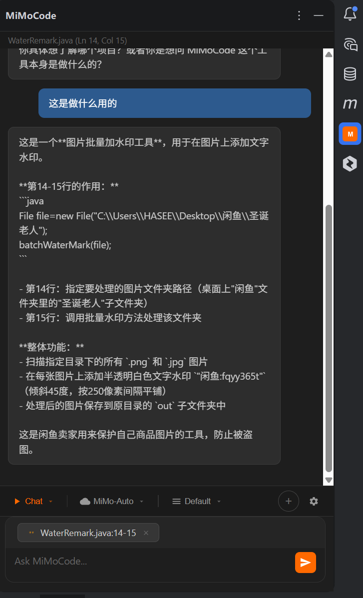
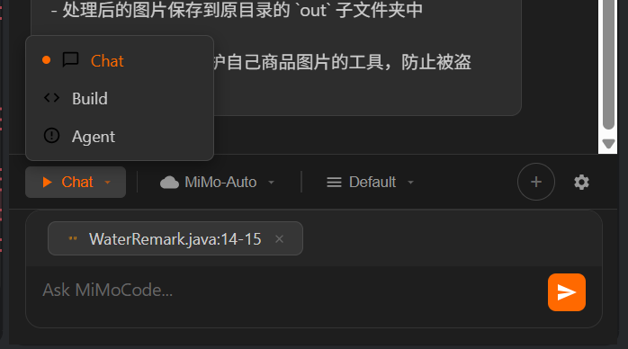
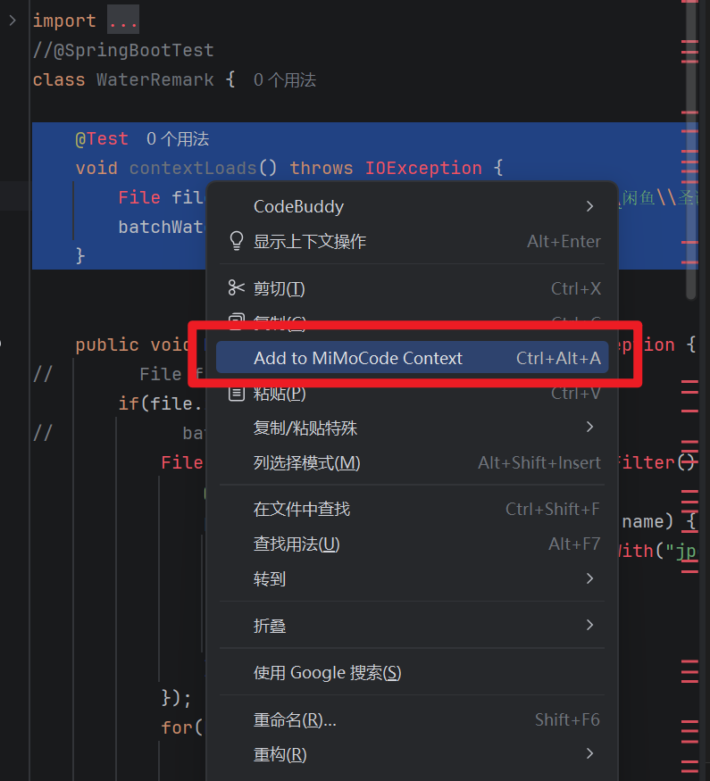

# MiMoCode JetBrains Plugin

[English](./README_EN.md)

MiMoCode 是一款 JetBrains IDE 插件，将 MiMoCode AI 编程助手直接嵌入到你的 IDE 中。它通过 JCEF（Java Chromium Embedded Framework）在侧边栏渲染一个完整的 AI 聊天面板，支持实时获取编辑器上下文、代码选择、流式响应等功能。

### 界面预览



## 功能特性

- **AI 聊天面板** — 在 IDE 侧边栏中直接与 AI 对话
- **实时上下文感知** — 自动获取当前活动文件、光标位置、打开的标签页
- **代码选择注入** — 选中代码后通过 `Ctrl+Alt+A` 快速添加到聊天上下文
- **流式响应** — AI 回复实时流式显示，支持思考时间计时
- **主题同步** — 自动跟随 IDE 的明暗主题
- **Git 分支检测** — 自动识别当前项目分支信息
- **文件导航** — 从聊天中的文件路径直接跳转到编辑器对应位置
- **多种模式** — 支持 Chat / Build / Agent 三种交互模式

  

- **模型切换** — 支持 MiMo-V2-Pro、MiMo-V2-Flash、MiMo-Auto、MiMo-Coder
- **上下文模式** — Default / Full / Compact / No Context 四种上下文策略
- **右键菜单集成** — 编辑器右键菜单中可直接添加选中代码到上下文

  

## 系统要求

- **JetBrains IDE** 2025.3 或兼容版本（IntelliJ IDEA、PyCharm、WebStorm 等）
- **JCEF 支持** — 大多数现代 JetBrains IDE 默认启用
- **MiMoCode CLI** — 插件会自动提取内置的二进制文件，也可通过以下方式手动安装：
  ```bash
  npm install -g @mimo-ai/cli
  ```
- **JDK 21** — 编译插件需要

> **已验证环境**：PyCharm 2025.3、IntelliJ IDEA 2025.3，均已测试通过，可正常使用。

## 快速开始

### 构建插件

```bash
# 克隆项目
git clone https://github.com/your-username/mimocode-jetbrains-plugin.git
cd mimocode-jetbrains-plugin

# 构建插件
./gradlew buildPlugin

# 验证兼容性
./gradlew runPluginVerifier

# 在沙箱 IDE 中运行测试
./gradlew runIde
```

构建产物位于 `build/distributions/` 目录下。

### 安装插件

1. 构建插件或从 Releases 下载
2. 打开 JetBrains IDE，进入 `Settings > Plugins > Install Plugin from Disk`
3. 选择构建好的 ZIP 文件
4. 重启 IDE

### 使用方法

| 操作 | 快捷键 | 说明 |
|------|--------|------|
| 打开/关闭面板 | `Ctrl+\` (Windows/Linux) / `Cmd+\` (macOS) | 切换 MiMoCode 侧边栏面板 |
| 添加代码到上下文 | `Ctrl+Alt+A` | 将选中的代码添加到聊天上下文 |
| 发送消息 | `Enter` | 发送输入内容 |
| 换行 | `Shift+Enter` | 在输入框中换行 |

## 项目结构

```
src/main/
├── java/ai/mimo/plugin/
│   ├── actions/
│   │   ├── AddToContextAction.kt    # 添加选中代码到上下文的 Action
│   │   └── OpenPanelAction.kt       # 打开面板的 Action
│   ├── bridge/
│   │   ├── BrowserBridge.kt         # JCEF 浏览器桥接，处理 IDE ↔ WebView 通信
│   │   └── IdeContextService.kt     # IDE 上下文服务，监听编辑器事件
│   ├── server/
│   │   └── ServerManager.kt         # MiMoCode CLI 服务进程管理
│   ├── settings/
│   │   ├── MiMoConfigurable.kt      # 设置面板 UI
│   │   └── MiMoSettings.kt          # 持久化配置
│   └── toolwindow/
│       └── MiMoToolWindowFactory.kt # ToolWindow 工厂，初始化面板
└── resources/
    ├── META-INF/plugin.xml          # 插件描述文件
    ├── icons/mimo.svg               # 插件图标
    └── webview/
        └── index.html               # 聊天面板前端（HTML/CSS/JS）
```

## 架构设计

```
┌─────────────────────────────────────────────────────────────┐
│  JetBrains IDE                                              │
│  ┌──────────────────┐  ┌──────────────────────────────────┐ │
│  │  ToolWindow       │  │  IdeContextService               │ │
│  │  (JCEF Browser)   │  │  - 文件编辑事件监听              │ │
│  │                   │  │  - 光标位置跟踪                  │ │
│  │  ┌──────────────┐│  │  - 主题变化监听                  │ │
│  │  │  index.html   ││  │  - Git 分支检测                  │ │
│  │  │  (WebView)    ││  └───────────┬──────────────────────┘ │
│  │  └──────┬───────┘│              │                         │
│  └─────────┼────────┘              │                         │
│            │ JBCefJSQuery          │ sendActiveEditor()      │
│            │ (JS ↔ Kotlin Bridge)  │ sendTabs()              │
│            │                       │ sendTheme()             │
│  ┌─────────▼───────────────────────▼──────────────────────┐ │
│  │  BrowserBridge                                          │ │
│  │  - 内置 HTTP 文件服务器                                  │ │
│  │  - JS ↔ IDE 消息路由                                    │ │
│  │  - SSE 流式事件监听                                     │ │
│  └─────────────────┬───────────────────────────────────────┘ │
│                    │ HTTP                                     │
│  ┌─────────────────▼───────────────────────────────────────┐ │
│  │  ServerManager                                          │ │
│  │  - 管理 mimo serve 子进程                                │ │
│  │  - 端口分配 & 健康检查                                   │ │
│  │  - 进程锁文件管理                                        │ │
│  └─────────────────┬───────────────────────────────────────┘ │
└────────────────────┼────────────────────────────────────────┘
                     │
              ┌──────▼──────┐
              │  MiMoCode   │
              │  CLI Server │
              │  (AI 后端)   │
              └─────────────┘
```

### 通信流程

1. **启动阶段**：`ServerManager` 启动 `mimo serve` 进程，分配端口并等待健康检查通过
2. **面板加载**：`BrowserBridge` 启动本地 HTTP 文件服务器，注入配置脚本后加载 `index.html`
3. **上下文同步**：`IdeContextService` 监听 IDE 事件（文件切换、光标移动、主题变化），通过 `BrowserBridge` 推送到 WebView
4. **消息发送**：WebView 通过 `JBCefJSQuery` 桥接将用户消息发送到 `BrowserBridge`，再转发到 MiMoCode CLI 的 HTTP API
5. **流式响应**：`BrowserBridge` 通过 SSE（Server-Sent Events）接收 AI 响应，实时推送到 WebView 渲染

## 配置说明

插件使用内置的 MiMoCode 二进制文件，无需额外配置。如需自定义可执行文件路径，可在 `Settings > Tools > MiMoCode` 中设置。

MiMoCode CLI 服务的配置文件位于：
- 进程锁文件：`~/.mimocode-plugin/server.json`
- 二进制文件：`~/.mimocode-plugin/bin/mimo`（从插件资源自动提取）

## 开发指南

### 技术栈

- **语言**：Kotlin
- **构建工具**：Gradle (Kotlin DSL)
- **插件框架**：IntelliJ Platform Plugin SDK 2.1.0
- **UI 框架**：JCEF (Java Chromium Embedded Framework)
- **最低 JDK**：21

### 本地开发

```bash
# 在沙箱 IDE 中启动插件（会自动下载 IDE 实例）
./gradlew runIde

# 构建可分发的插件包
./gradlew buildPlugin

# 运行插件兼容性验证
./gradlew runPluginVerifier
```

### 修改前端界面

聊天面板的前端代码位于 `src/main/resources/webview/index.html`，这是一个单文件应用（HTML + CSS + JavaScript），修改后重新构建即可生效。

## 许可证

[MIT License](LICENSE)

## 相关链接

- [MiMoCode 官网](https://mimo.xiaomi.com)
- [MiMoCode CLI](https://www.npmjs.com/package/@mimo-ai/cli)
- [JetBrains Plugin SDK 文档](https://plugins.jetbrains.com/docs/intellij/)
